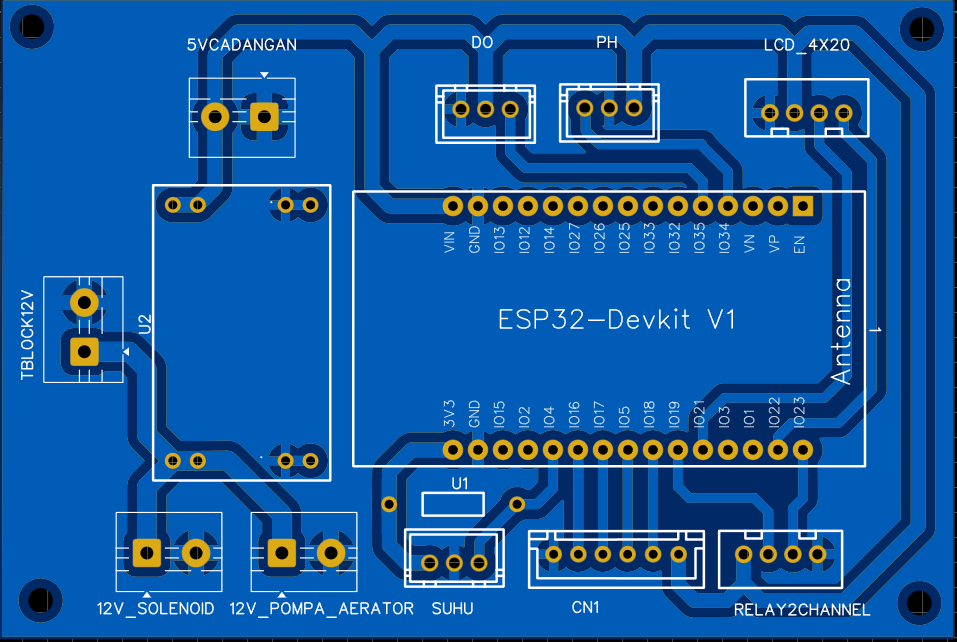
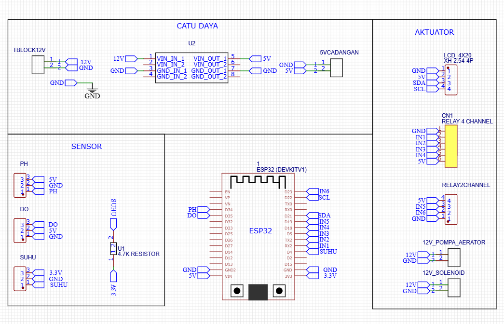

# 🐟 IoT-Based Water Quality Control and Monitoring System for Nile Tilapia Pond

An ESP32-based IoT system for automated multi-parameter water quality monitoring and control in a Nile tilapia (*Oreochromis niloticus*) aquaculture pond, with real-time data visualization via Flutter mobile dashboard and Firebase cloud integration.

---

## 🔍 Overview

This project implements a closed-loop water quality management system that continuously monitors pH, dissolved oxygen (DO), and water temperature in a fish pond. Based on sensor readings, the system automatically activates actuators (aerator, water pump, solenoid inlet/outlet) to maintain optimal water conditions for Nile tilapia. All data is logged to Firebase and visualized in real-time through a Flutter mobile dashboard accessible by multiple users.

---

## ⚙️ System Architecture

```
[Fish Pond]
     ↓
[Sensors: pH · DO · Temperature]
     ↓
[ESP32 — C/C++ Firmware]
     ├── Automated Actuator Control Logic
     │       ├── Aerator (DO control)
     │       ├── Water Pump
     │       ├── Solenoid IN  (water fill)
     │       └── Solenoid OUT (water drain)
     ↓
[MQTT Protocol]
     ↓
[Firebase — Real-time Database & Auth]
     ↓
[Flutter Mobile Dashboard — Multi-user]
```

---

## 🛠️ Hardware Components

| Component | Function |
|---|---|
| ESP32 | Main microcontroller, WiFi, firmware logic |
| pH Sensor | Monitors water acidity/alkalinity |
| DO Sensor | Monitors dissolved oxygen level |
| Temperature Sensor | Monitors water temperature |
| Main Aerator | To maintain oxygen levels in the water |
| Aerator Backup | Increases dissolved oxygen when DO is low |
| Agitator | Stirring the settled dolomite solution |
| Water Pump | Functions for injecting dolomite lime solution to increase pH |
| Solenoid Valve IN | Opens to fill pond with fresh water |
| Solenoid Valve OUT | Opens to drain pond water |
| Custom PCB (EasyEDA) | Electrical integration & wiring |

---

## 💻 Software & Tech Stack

| Layer | Technology |
|---|---|
| Firmware | C/C++ (Arduino framework) |
| Communication | MQTT Protocol |
| Cloud Database | Firebase Realtime Database |
| Authentication | Firebase Auth (multi-user) |
| Mobile Dashboard | Flutter (Android/iOS) |
| Schematic Design | EasyEDA |

---

## 🔧 Features

- **Real-time multi-parameter monitoring** — pH, DO, and temperature displayed live on mobile dashboard
- **Automated actuator control** — aerator, pump, and solenoid valves triggered based on sensor thresholds
- **MQTT communication** — lightweight, reliable data transmission between ESP32 and cloud
- **Firebase cloud integration** — real-time data logging with historical graph visualization
- **Multi-user Firebase Auth** — multiple users can monitor the system simultaneously
- **Solenoid IN/OUT control** — automated water fill and drain for water quality maintenance
- **Mobile-first dashboard** — Flutter app accessible on Android and iOS

---

## 🌊 Water Quality Parameters & Thresholds

| Parameter | Optimal Range | Action if Out of Range |
|---|---|---|
| pH | 6.5 – 8.5 | Activate the dolomite lime solution injection circuit |
| Dissolved Oxygen (DO) | > 4.5 mg/L | Activate aerator backup |
| Temperature | 25°C – 30°C | Activate water pump / water exchange |

> Thresholds are configurable in firmware.

---

## 📁 Repository Structure

```
fishpond-monitoring/
├── firmware/
│   └── main.ino              # ESP32 firmware (C/C++)
├── flutter-app/
│   └── lib/                  # Flutter mobile dashboard source
├── schematic/
│   └── schematic.pdf         # PCB & wiring schematic (EasyEDA)
├── docs/
│   └── images/               # System photos & diagrams
└── README.md
```

---

## 📸 Documentation

| System Overview | Mobile Dashboard | Hardware Setup | Schematic |
|---|---|---|---|
|  |  |  |   |

---

## 🚀 How to Run

### Firmware (ESP32)
1. Clone this repository
   ```bash
   git clone https://github.com/farhanibnufajar/fishpond-monitoring.git
   ```
2. Open `firmware/main.ino` in Arduino IDE
3. Configure credentials:
   ```cpp
   const char* ssid       = "YOUR_WIFI_SSID";
   const char* password   = "YOUR_WIFI_PASSWORD";
   const char* mqtt_server = "YOUR_MQTT_BROKER";
   ```
4. Upload to ESP32 — select board: `ESP32 Dev Module`

### Flutter App
1. Open `flutter-app/` in Android Studio or VS Code
2. Configure `firebase_options.dart` with your Firebase project credentials
3. Run: `flutter pub get` then `flutter run`

---

## 👤 Author

**Farhan Ibnufajar**
Electrical Engineering — Universitas Jenderal Soedirman (Unsoed)

[](https://github.com/farhanibnufajar)
[](https://farhanibnufajar.github.io)

---

## 📄 License

This project is open source and available under the [MIT License](LICENSE).
